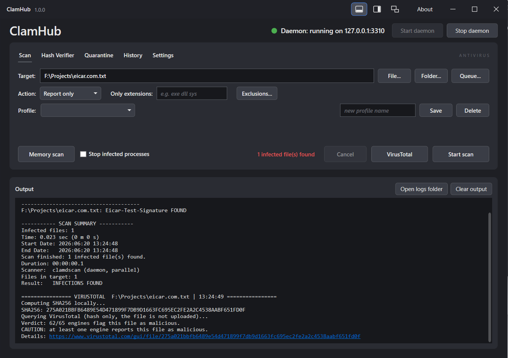
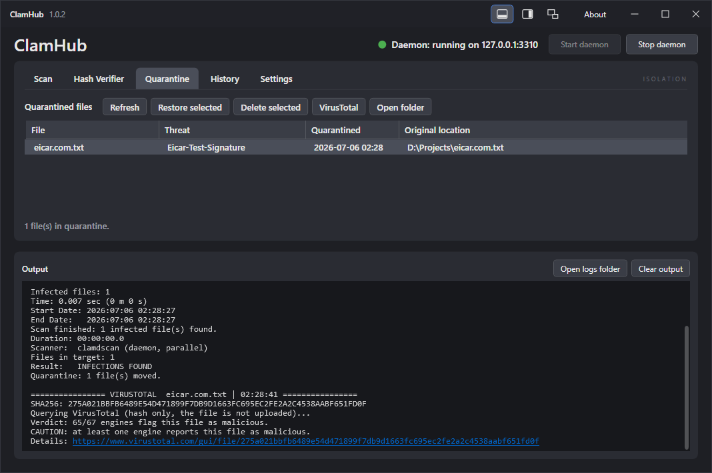
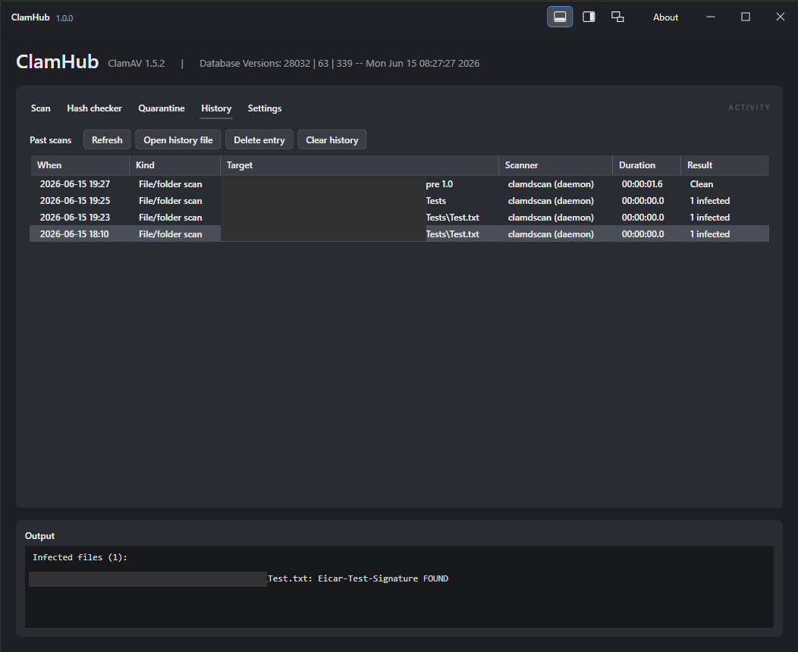
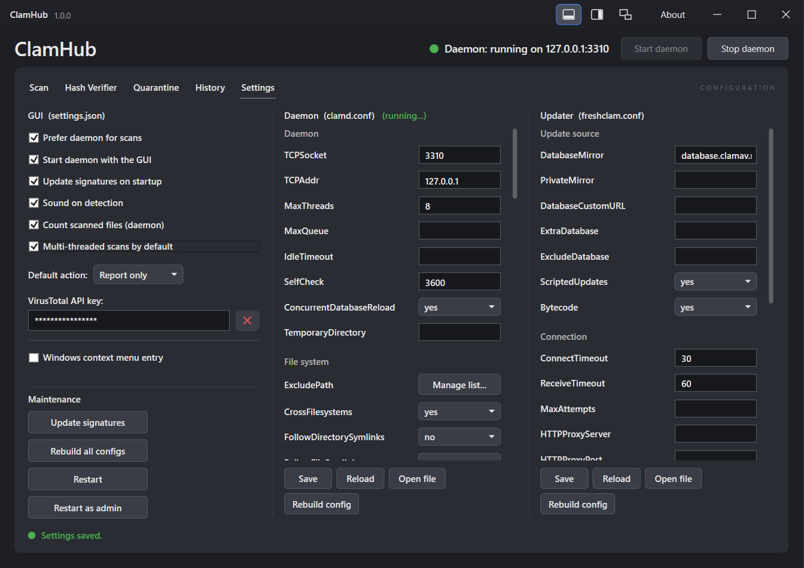
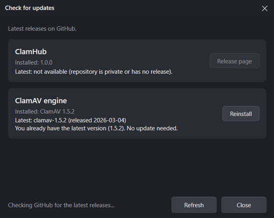
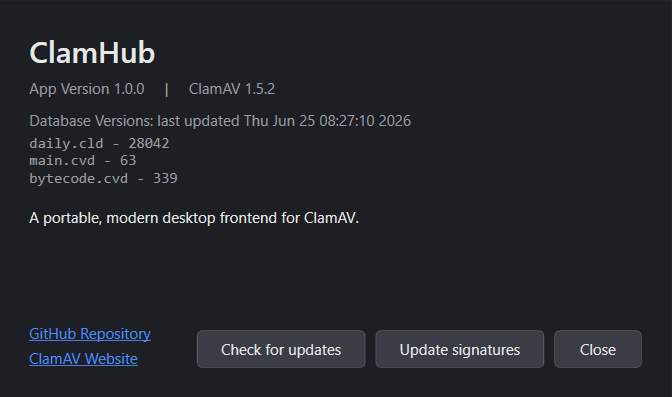
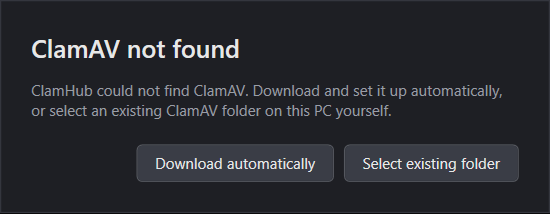

<p align="center">
  
</p>

An open-source application for using [ClamAV](https://www.clamav.net) with a GUI on Windows. Just run the EXE and go - portable, always up-to-date, 

---

## What is this?

I usually use ClamAV with a batch script on my personal computer. It's rudimentary, not easy to use and very restrictive. A GUI would be nice... I thought. Sure there are some similar applications on GitHub, like [ClamShield](https://github.com/orloxgr/ClamShield); [ClamAV Native Win32](https://oss.netfarm.it/clamav/) or [ClamUI](https://github.com/linx-systems/clamui) on Linux. I was missing a portable version you can carry around on a flash drive, something with a user friendly GUI and clear instructions and feedback...

So I sat down and worked on this project. I put a lot of effort into designing an all around experience with usability in mind. Of course I had some coding help from Claude Opus 4.8 and Fable 5 for this, just like our AI overlord insists! (Roko’s Basilisk is watching)

And here it is:

ClamHub puts a clean, dark UI on top of ClamAV so you do not have to deal with the command line. Scans run fast thanks to the multi-threaded daemon, the interface stays out of the way, and nothing gets written outside the app folder. Works on any (Windows) machine without installation or requiring admin rights (unless you want to scan protected system paths).

## Highlights

- **Portable** - the entire setup lives in one folder, move it wherever you want
- **Fast** - Highly responsive UI with no hickups or bugs (I am still testing everything)
- **Modern dark UI** - custom title bar, clean tab layout, no clutter
- **Smart console layout** - dock the output below, to the right, or pop it into a separate window. On the Settings tab the console hides automatically so the config editors get the full space
- **No surprises** - configs are generated once on startup and are highly customizable within the settings tab
- **Profiles** - save your regular scans in profiles for repeatable workflows

---

## Usage

### Scan
<p align="center">

</p>

- Pick or Drag and Drop a file, folder or entire drive and hit 'Start Scan'. The app prefers the ClamAV daemon (`clamdscan`) for parallel multi-core scanning and falls back to `clamscan` automatically if the daemon is not running.
- You can filter by file extension (e.g. `exe dll sys`) or even exclude paths systemwide or for a particular scan to skip irrelevant files. You can also query multiple files and folders at once so scanning becomes more efficient!
- Run a **memory scan** to check running processes and kill them instantly.
Infected files can be reported only, moved to quarantine, or deleted - your choice per scan.
- Use VirusTotal as a secondary scan for single files. (sends only the hash of the file to VirusTotal for a report) 
- Create profiles for your custom scans. You can even save queues for reoccuring tasks
- Scans can be cancelled at any point.

---

### Hash Verifier
<p align="center">

</p>

- Drop or browse to any file and compute its hash. Supports SHA-1, SHA-256, SHA-384, SHA-512 and MD5 - individually or all at once.
- Paste an expected hash to get an instant match / mismatch result
- If you have a VirusTotal API key set up (in Settings), you can look up the file's SHA-256 directly from this tab. Only the hash is sent - the file never leaves your machine

---

### Quarantine
<p align="center">

</p>

Shows every file ClamHub has quarantined, with the original path, date and file name. From here you can:

- **Restore** a file back to exactly where it came from
- **Delete** it permanently
- **Check it on VirusTotal** using its stored hash
  
---

### History
<p align="center">

</p>

- Every completed scan is saved automatically. The history table shows when it ran, what was scanned, which scanner was used, how long it took and how many infected files were found.
- History will also show actions you made in Quarantine or Hash Verifier
- Click any entry to see the full report of the scan or action.
- You can clear the history or open the raw JSON file directly.
- Deletion of entries or the whole history is supported as well.

---

### Settings
<p align="center">

</p>

The Settings tab gets the full window - the output console hides here so the config editors have room to breathe. Use the widened window option to have even more space!
From Settings you can configure the default behaviour of the app, as well as the config files of the daemon (clamd.conf) and the updater (freshclam.conf)

You can also:
- Add or remove path and extension exclusions under Daemon > File system > Exclude Path
- Enable the Windows Explorer context menu entry ("Scan with ClamHub") for all files
- Enter your VirusTotal API key to enable the VirusTotal feature in Scan, Hash Verifier and Quarantine
- Run diagnostics with ClamAVs built-in clamconf.exe.
- Always start in administrator mode.
- Open the `clamd.conf` and `freshclam.conf` directly if you need to
- and many more...

### Update Checker

<p align="center">

</p>

- Keeping the app up-to-date is simple. You can update the app via the "Check for updates" button in the Settings tab or by navigating to the "About" window in the top right corner of the app.
<p align="center">

</p>
- ClamHub will show you the newest updates there. Press download and wait.


## Getting started

1. Place `ClamHub.exe` in any folder
2. Run the .exe and select one of the following options.
<p align="center">

</p>

  - a) Download automatically: The official ClamAV build is automatically being downloaded and extracted next to the ClamHub.exe. Fully automatic and no further clicks needed.
  - b) Manually select existing ClamAV folder: It does what it says. Search for your own ClamAV installation and select the folder. It automatically detects all databases and executables within. ClamAV can be downloaded at [clamav.net](https://www.clamav.net/downloads)
3. Have fun hunting for viruses :)

## Building it yourself

Requires .NET SDK 10.0.301 or newer.

```
dotnet build        # debug
publish.cmd         # portable single-file release into .\publish
```

---

## Notes

- Moving the app folder invalidates the Explorer context menu entry - just toggle it off and back on in Settings
- `clamdscan` produces a shorter native summary than `clamscan`; ClamHub adds its own summary block with engine, target, duration and result after every daemon scan

## Future

- ClamHub is in active development. Expect multiple updates over the first few months! One feature that's currently missing is the sigtool.exe form ClamAV I really want to look into a bit more before I implement it into ClamHub.
- 
